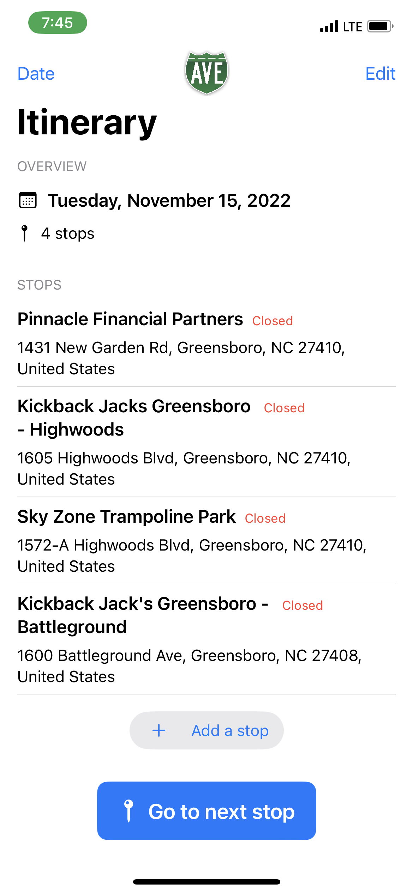
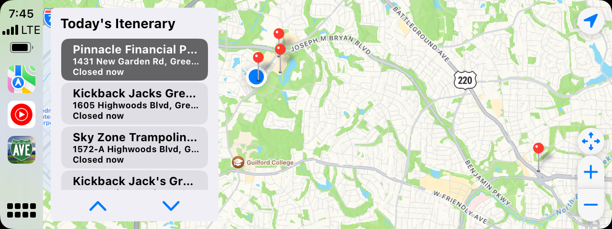
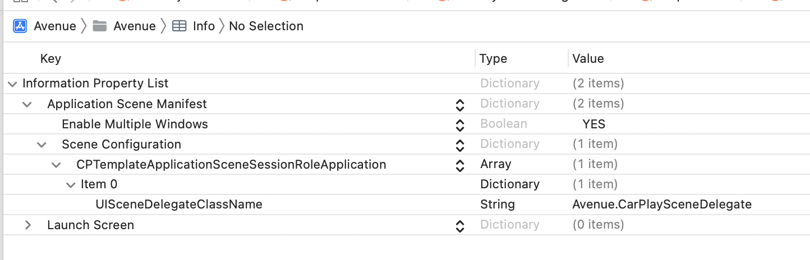
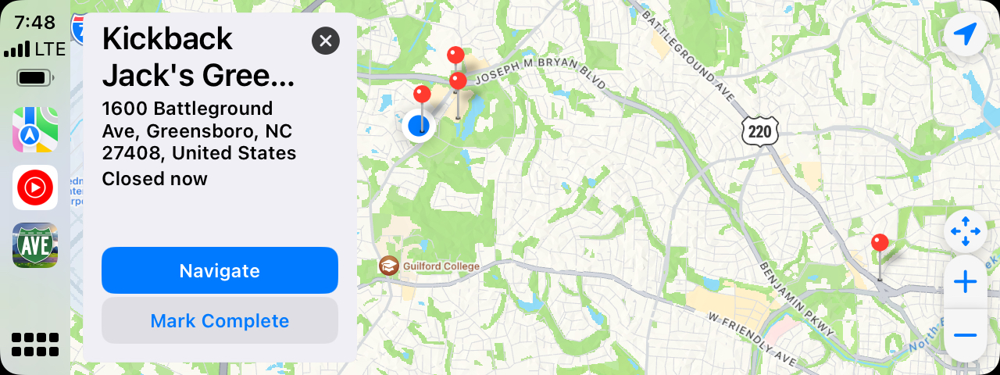

### Backstory ###

When the Avenue app first launched in 2019, its primary purpose was to be a route optimization tool for small business owners who made a lot of stops throughout their day. For instance, a good friend of mine with a lawn care business could input all of the customers he needed to mow at throughout his day, and the app would package this data up to a traveling salesman algorithm API that analyzed traffic patterns and other factors to determine the best order for each stop. After a year of COVID almost killing our service, what we learned is that there are more people who already know the general *order* they need to travel, but it would be more helpful to connect to their scheduling service to provide that information to them on their mobile device. So we scratched the traveling salesman API, rewrote the app in updated SwiftUI, and set out to connect with 3rd party scheduling services like HouseCallPro. We still have a way to lookup customers from your contacts/address book or Google maps within the app, but our real value-add now was getting a list of your scheduled stops and presenting them in a meaningful way to customers. The timing couldn't have been better for Apple to open up Carplay to developers.

By connecting our app to Carplay, we have the advantage of showing all of your stops in a list overlayed on a map. Tapping on each stop provides the stop details pulled from your CRM/ERM, and we have two easy "Navigate" and "Complete Stop" buttons that make it super easy to kick off driving directions and mark a stop as complete.

### Getting Started ###

We didn't expect to have to *apply* to Apple for a Carplay entitlement, but they responded within two business days and approved our request to add Carplay capabilities to the Avenue App. I think it helped that we already had our app approved in the *Transportation* category that we applied for Carplay capabilities.

#### Carplay Simulators
Our first challenge was getting the Carplay Simulator to work. There are two ways that Apple gives you to start off: adding a Carplay screen to your simulator, and a standalone radio head unit simulator app that runs on your Mac and requires connecting a USB cable. It would have been great if either of those options worked right out of the box, but we had difficulty getting either to work consistently and reliably. The iPhone simulator Carplay screen simply refused to work at all, and we spent way too long troubleshooting only to realize it was very buggy. The head unit simulator app was buggy as well, and never consistently recognized the iPhone when it was connected to USB. 
    
#### Carplay Head Unit

After much frustration with simulators, we decided to purchase a portable Carplay head unit that could sit on our desk. This was a great choice, as it played into our business model of providing external units for customers who did not have Carplay already installed in their service vehicles. It also provided the most realistic user experience and kept us from having to travel out to the car every time we wanted to test a change. 

The unit we selected as our demo was the Road Top Wireless Carplay & Android Auto Portable Receiver [Amazon](https://www.amazon.com/dp/B09P8C5V26?psc=1&ref=ppx_yo2ov_dt_b_product_details):

    Road Top Wireless Carplay & Android Auto, Wireless Mirroring Portable 8.8" Touchscreen Car Radio Receiver with Siri, Mic, Bluetooth 5.0, WiFi, FM, GPS Navigation Dash Windshield Mounted
 
What we liked is that the screen was very high quality, we liked the width-to-height ratio, and it supported wireless Carplay. RoadTop also had a number of solid reviews that made us more confident that it was a good decision.
 
We quickly ran into our second setback when we realized that our newly purchased unit was meant for a *vehicle*, and it didn't have an A/C adaptor, only a cigarette charger. We bought a universal A/C adaptor that flexes on voltage and tip sizes [Amazon](https://www.amazon.com/dp/B09WMS6K9C?psc=1&ref=ppx_yo2ov_dt_b_product_details):
    
    Arkare 30W Universal AC to DC Power Adapter Adjustable Power Supply 3V 4.5V 6V 9V 12V 2A 1A DC Adapter AC 100-240V to DC 3-12V Multi Voltage Switching Power Adapter with 15 Tips + Polarity Converter
    
Finally, the hardware was setup and ready for development.

### Development

#### InfoPlist 
Getting the updated entitlement added into the project was easy, but making the adjustments to the XCode project info.plist file felt a little rough around the edges from Apple's documentation. Suffice it to say that documentation and user guides are in the infant stages for Apple as well. Our final plist file looked like this:

#### CarplaySceneDelegate
Unlike watch apps, widgets, Siri extensions, etc, Carplay is not a separate target within your project. Instead, you have a class that inherits from a specific Carplay protocol that gets defined in your info plist file. It's interesting that Apple did it this way, but (for us) it actually cut down on having to do things like use AppGroups and bother with keychain sharing.

    class CarPlaySceneDelegate: UIResponder, ObservableObject, CPTemplateApplicationSceneDelegate {
        var interfaceController: CPInterfaceController?
        weak var scene: CPTemplateApplicationScene?

        func templateApplicationScene(_ templateApplicationScene: CPTemplateApplicationScene, didConnect interfaceController: CPInterfaceController) {
            self.interfaceController = interfaceController
            self.scene = templateApplicationScene
            
            let template = CPPointOfInterestTemplate(title: "Itenerary", pointsOfInterest: pointsOfInterest, selectedIndex: 0)
            interfaceController.setRootTemplate(template, animated: false, completion: nil)
        }

        ...
    }

One thing that is similar to building watch apps is the use of templates to lock developers into specific UI styles and patterns. For our use case, the `CPPointOfInterestTemplate` matched perfectly.

#### Data Synchronization
Because our class is instantiated by the operating system and its delegate methods are called in a lifecycle outside of the Avenue app, we are left with the challenge of synchronizing data between the Avenue app and Carplay. Obviously, there are multiple ways to accomplish this, but because we are working in the same app target and sandbox, we utilized file writing and Notification Center.

    NotificationCenter.default.publisher(for: ItineraryStore.postNotificationName)
            .map(\.object)
            .compactMap { $0 as? ItineraryStore.NotificationPayload }
            .sink { [weak self] payload in
                guard let self = self else { return }
                self.date = payload.date
                self.dateKey = payload.key
                self.stops = payload.stops
            }
            .store(in: &observers)

When our `ItineraryStore` posts a notification that its payload has changed, we receive that notification in our `CarplaySceneDelegate` class. As we transform the data from our notification payload into relevant objects for use in Carplay, we simply update our root template with the new data:
    $pointsOfInterest
            .receive(on: RunLoop.main)
            .sink { [weak self] pointsOfInterest in
                let template = CPPointOfInterestTemplate(title: "Today's Itenerary", pointsOfInterest: pointsOfInterest, selectedIndex: 0)
                self?.interfaceController?.setRootTemplate(template, animated: false, completion: nil)
            }
            .store(in: &observers)

Because you can mark a job as complete within Carplay, we then have to update our `ItineraryStore` with updated data. The data store class made light work of this, and it was easy to implement because we didn't have to worry about multiple targets and app sandboxes.

    func makeCompleteButton(
        stop: Stop
    ) -> CPTextButton {
        CPTextButton(title: "Mark Complete", textStyle: .normal) { [weak self] _ in
            guard let self = self else { return }
            let newStop = Stop(...)
            guard let index = self.stops.firstIndex(of: newStop) else { return }
            self.stops[index] = newStop
            Task(priority: .background) { 
                ItineraryStore.Loader.save(self.stops, key: self.dateKey)
                ItineraryStore.post(self.stops, key: self.dateKey, date: self.date, sender: "carplay")
            }
        }
    }

### Final thoughts
Overall, the Carplay implementation was very easy and straightforward. Implementing delegate methods is not a new concept by any means, and although there are some peculiar concepts like using templates, Carplay-specific UI elements, there aren't many hurdles for implementation. I think Apple is going to have to be very selective about what apps get approved for Carplay, so that we're not having to manage yet *another* springboard of apps 😅.

