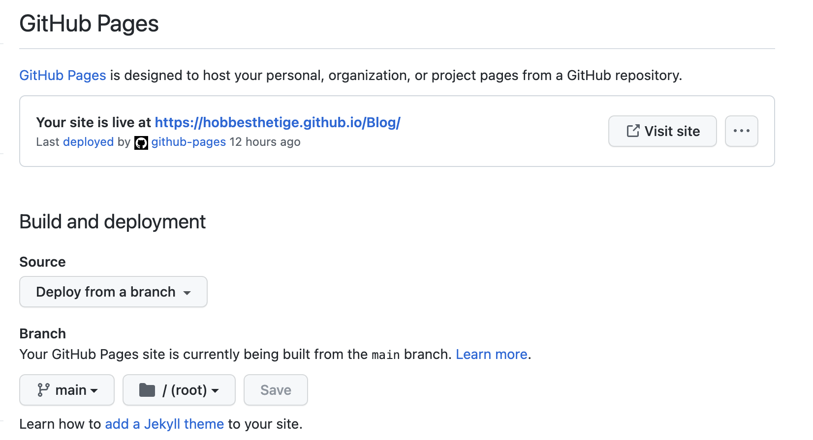
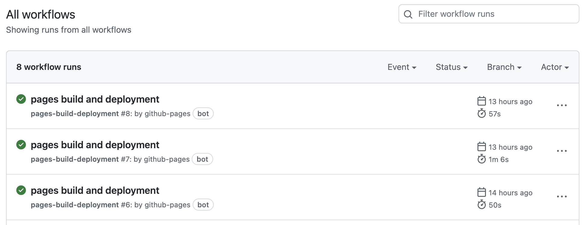
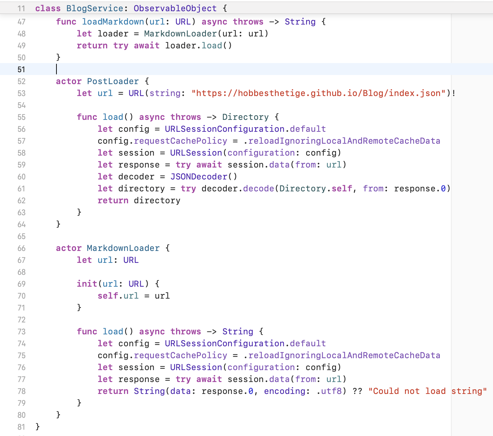

### Backstory
As I was building out my personal app, I was looking for a way that I could showcase some features that are meaningful and have some value behind them (something a little more than saying I love coding in SwiftUI but you'll have to take my word for it). Since I regularly work on side projects and pick topics for Friday iOS Lunch'n'Learns, I thought it would be a good idea to start a blog to showcase my work and also provide some dynamic content within my app.

### Getting Started
I wasn't really interested in kicking off a website blog, partially because I wanted the browsing experience on the mobile app to feel natural and native. After dealing with web-wrapped views and ReactNative at Ally, I was looking for a blogging solution that was flexible in layout and flows, easy to manage outside of app software updates, and has support for images and external URLs. 

#### HTML
Although it's possible to write HTML and writing some styling to match my app, I felt like it was both extraneous and a difficult to manage. I pulled up one of my website's React code and stared down at it for quite a while thinking about how I could start blogging on it, match my app's style guide, and also have the app interact with the blog in a natural and native way. I abandoned this idea because I felt like it was taking away from the original purpose of the website, and it felt like overkill to spin up a new domain name and hosting space just for blog hosting.

#### Markdown
I typically write in Markdown when I'm rough-drafting some thoughts or writing creative stories with my daughter in our free time. It is very flexible and powerful, and Apple's new support for it really sparked my interest. I've used 3rd party packages to support Markdown in my Avenue app to display privacy policies and terms of service, but I was really intersted in seeing if I could leverage Apple's SwiftUI Markdown support and create some great blog content directly in the app.

##### Apple's Markdown
It was a great start in the right direction, but ultimately it just didn't have the flexibility that I needed. As it turns out, Markdown is *lightly* supported by Apple, including no support for headers, lists, images, etc. Well, that was a bummer for *blogging*, but I hated to move away from Markdown entirely so I looked into what it would take to customize `AttributedString` in Apple's Markdown. I was thinking that it would be possible to just add support for the missing areas, but the further I dug into it, the more it looked like I would rely on copy/pasting something from StackOverflow and then modifying it slightly. 😬 Nah, that's not a great idea. So rather than trying to get into a huge deep dive of Apple's Markdown parsing customization, I decided to revisit 3rd party Swift packages.

##### MarkdownUI
I actually went back to the 3rd party package that I used in the Avenue App, [MarkdownUI](https://github.com/gonzalezreal/MarkdownUI). It worked great for my simple legal documents, but I was barely scratching the surface of its capabilities in the Avenue App. `MarkdownUI` has built-in support for headers, lists, and images. This made it an ideal candidate for blog posts and after running through a few locally hosted markdown files, I found the formatting to be very close to my app and the continuity was great. 

#### Hosting
The next step was to find a way to host markdown files and images while also having a sort of structure that the mobile app could integrate with dynamically. I wanted the blog posts to appear as a list on the app with a title and subtitle. When the user taps on the post, it would display the full blog post. Simple enough, right?!

There are definitely multiple ways to achieve my simple requirements. The solution I went with was to create a project on `GitHub` because, well, it's designed for this. GitHub was an ideal candidate because it has git management, a basic file structure, and hosting support through it's workflows.

### Development

#### Setting up a GitHub project
First, I created a new project called `Blog`. Nothing special about that.
Second, I enabled pages build and deployment from the `Settings -> Pages` tab in the repo. If you're following along and setting this up yourself, you will need to make an initial commit to the repo so that you can setup the build and deployment from your choice branch.

#### Organizing the project for a blog
Organization is pretty easy. Each blog post can be its own directory and have assets in the same folder.

#### Directory Indexing
I needed a way to communicate to the mobile app what my file structure was like, and give it some data points for creating the list of blog posts. Of course, there's a bunch of ways this could happen, in increasing levels of coolness and complexity 😎 For the sake of brevity, I just decided to create an `index.json` file in the root directory that the mobile app could read and parse.

    {
        "posts": [
            {
                "title": "Implementing Carplay in the Avenue app",
                "subtitle": "Challenges and rewards along the way.",
                "published": "Written October 2022",
                "url": "https://hobbesthetige.github.io/Blog/Carplay/BlogCarplay.md",
                "coverImage": "https://hobbesthetige.github.io/Blog/Carplay/Cover.png"
            }
        ]
    }

#### Deployments
`GitHub` makes it so easy to push changes. After committing and pushing changes to the repo, the workflow publishes the files to a publically accessible URL typically within 30-60 seconds. The best part is that the markdown file URL doesn't have a particular commit hash associated with it, so you always get the latest and greatest file data.

#### Mobile App Implementation
On the app side, I created a `BlogService` actor that parses `index.json` into objects that are displayed in a list. When the user taps on a blog item, the cover image is loaded using `AsyncImage` and the markdown data is loaded asynchronously and displayed when it is finished loading. Because the `MarkdownUI` package allows you to pass in a `baseURL` to reference locally-referenced images, the images are loaded inline without any additional code changes. Awesome.

#### Implementation Challenges
When I pushed changes to `GitHub`, I found that the markdown files were still using cached versions. That's probably not a huge deal, because I doubt the blog will change much once the posts are up. For the sake of debugging though, I needed to ignore protocol cache in my `URLSession` when loading my `index.json` file:
    
    let config = URLSessionConfiguration.default
    config.requestCachePolicy = .reloadIgnoringLocalAndRemoteCacheData
    let session = URLSession(configuration: config)

I found that `MarkdownUI` didn't really have great initializer methods for remote markdown data. I ended up having to download the markdown string data and then pass in the remote URL for image loading, which was kind of awkward. It seems like a good feature request for the `MarkdownUI` package. 

I also noticed that markdown images don't have a loading state and on slower connections the markdown text loads, but the images all appear at the same time after several seconds. That also seems like a defect in `MarkdownUI` but it's bearable (all things considered).

As of right now, I have not tried to implement any sort of code block syntax highlighting, but that would be great for blog posts where I include Swift code. I couldn't find much support for that in the `MarkdownUI` package, but I didn't spend much time looking into it.

### Final Thoughts
So far, I am very happy with my blog implementation. It is simple enough that there's not a lot of overhead for adding a new post, and it has flexibility and meets the same style guidelines as the mobile app to look and feel like native content. I am very happy with `GitHub` as the content provider (and it's free too), and `MarkdownUI` is a great wholistic Markdown Swift package that I highly recommend for users with advanced markdown needs.