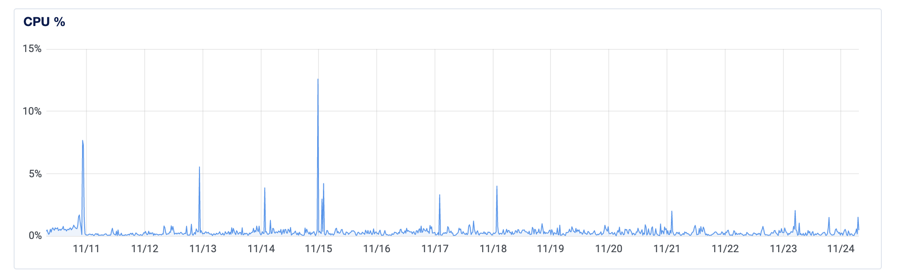
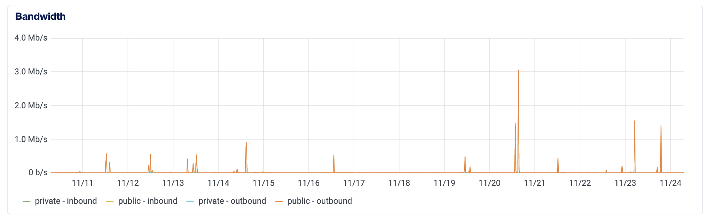
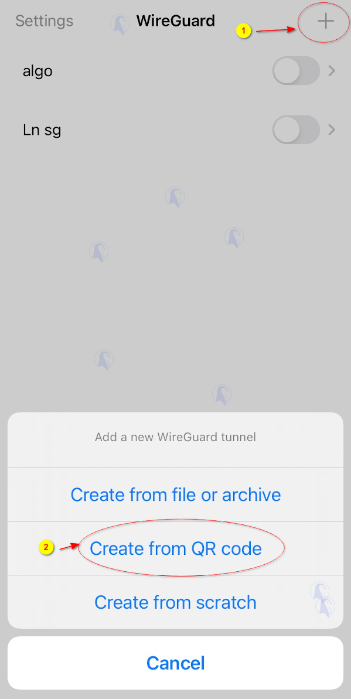

### Backstory
I have some anonymous friends who are living in an opressed country where VPNs, safe communications, and the broader internet of information is proactively blocked. These types of places are familiar to anyone who has opened and read the news lately, so suffice it to say that when I was approached to help my family members whose commercial VPN access was blocked, I began looking for safe alternatives.

### Getting Started

#### WireGuard (WG)
Because most commercial VPNs have already been blocked by the government on residential ISPs, I began looking for lesser known VPN protocols that are easy to implement on a simple server. I was recommended to look into WireGuard, a lesser-known but very simple and secure VPN that can be setup on any Linux server. WireGuard(WG) also has a great option to keep a connection open without having to periodically pass keep-alive packets. This helps end-users keep their footprint small.

[WireGuard](https://www.wireguard.com/)

#### Hosting
WireGuard runs on Linux, so I needed to find a cloud hosted server that didn't charge me an arm and a leg for 24/7 uptime but would provide enough resources to host VPN for 3-4 end users. I settled on using an `Droplet` from [DigitalOcean](https://www.digitalocean.com/). Their droplets can be configured any number of ways, but I settled on the absolute cheapest because I knew the workload just wouldn't require anything more. 

> Ubuntu Linux 22.04 x64, 1 VCPU, 512MB RAM, 10GB disk, NYC data center
> My monthly recurring bill for this droplet is *$4*.

Again, I didn't need to do anything crazy with the droplet to get WG started.
Here's a simple breakdown of the actual resource usage over a 14 day period:





### Development
I'll focus on setting up WireGuard and how I verified that my configurations were working before sending them off to my friends.

Here's my disclaimer before I get into any actual setup:

> I do not use Linux on a regular basis, so I had to look up a few things particular to it. I also don't use the terminal that much, especially for hand-jamming config files. So if you see some places that could be improved, please send me a message-- I'm happy to learn.

#### Installing WireGuard
I know that WG can be installed on multiple flavors of Linux, but I stuck with Ubuntu because it seemed to be the most common and simple to get started.

[Official WireGuard installation instructions](https://www.wireguard.com/install/)
As you can see, installation is a one-liner.

Moving forward, you can setup WG to run by inputting commands through the terminal, or have it read from a config file. I chose the latter, so that I could come back and read the config files to remember what I was doing :) 

##### Network Interface 
After installing WG, we need to setup a network interface for it to run on.

`# ip link add dev wg0 type wireguard`

##### Server Config
Now we will create the server config which will also include peer information.

First, let's navigate to the WG folder:

`cd /etc/wireguard`

> Note: If you get `Permission Denied`, you can either use `sudo -s` or `sudo chown -R my /etc/wireguard/` to change your folder ownership. You can always change it back to `root` when you're done.

Now, let's create public and private keys for the server. This will be used for encryption with the clients. The `private` key will go into the config file we are about to make, and the `public` key will go into the client config files we will create later.

`umask 077`

` wg genkey | tee privatekey | wg pubkey > publickey`

I suggest copying your `private` key, we will need it in just a minute.

Now let's create the config file. I named my file `wg0.conf` to match the interface `wg0` from above, but the name can be anything.

Here is what the beginning of my config file looks like:

```
[Interface]
PrivateKey = XXX
Address = 10.0.2.1/32
ListenPort = 51820
PostUp = iptables -A FORWARD -i wg0 -j ACCEPT; iptables -t nat -A POSTROUTING -o eth0 -j MASQUERADE
PostDown = iptables -D FORWARD -i wg0 -j ACCEPT; iptables -t nat -D POSTROUTING -o eth0 -j MASQUERADE
```

Don't forget to replace `XXX` with your `server private key`.

Please note for `Address` you can put in any private IP address scheme. You'll just need to make sure that you don't assign the same IP address in client configs.

That's it for now. We will come back and add some peer/client entries later.

##### Client Config
I will need to make distinctions for desktop and mobile client types. For mobile clients, it's slightly easier to setup a config file because you can create the private keys on the server and import them into the phone using a generated QR code. For desktop clients, you will need to install WG and generate a private key similar to how we did the server setup above. For the sake of this blog post, I will just provide examples in mobile device setup.

I prefer to put my client configs in another folder, since they will also need their own private and public keys. I don't think you _have_ to have client configs created on the server, but it was easy enough for me to do it this way.

You will also need to create keys for each config file too. Because of this, you can either specify your public and private key names to match your config file, or create separate directories for each config file. Up to you. I did the former.

`cd client_config`

My naming convention was something like: `firstName_deviceType.config`, e.x. `daniel_phone.conf`.

Creating the keys:

`umask 077`

`wg genkey > daniel_phone_privatekey`

`wg pubkey < daniel_phone_privatekey > daniel_phone_publickey`

Copy the `private` key. You will need that in the config file. You will also want to have the `server public key` handy as well.

```
[Interface]
# Client Interface
PrivateKey = XXX
Address = 10.0.2.2/32
DNS = 1.1.1.1

[Peer]
# Server
PublicKey = XXX
AllowedIPs = 0.0.0.0/0
Endpoint = XXX:51820
```

Replace the following `XXX` with:

`PrivateKey = ` client private key

`Address = ` make sure you follow the private IP scheme in server config and your IP addresses don't overlap

`PublicKey` = server `public` key

`Endpoint` = your *droplet's* public IP address. I would suggest leaving the protocol at `51820`. 

If you noticed that `DNS = 1.1.1.1`, it kind of goes hand-in-hand with `AllowedIPs = 0.0.0.0/0`. You can see that `AllowedIPs` is a wildcard mask that forwards all traffic to the server. This is important for my particular use-case, but I also wanted to set a DNS server that was out of country as well, so I used Google's DNS server.

##### Server Config Revisited
We'll now need to add the client peer record to the server config file. It will now look something like this:

```
[Interface]
PrivateKey = XXX
Address = 10.0.2.1/32
ListenPort = 51820
PostUp = iptables -A FORWARD -i wg0 -j ACCEPT; iptables -t nat -A POSTROUTING -o eth0 -j MASQUERADE
PostDown = iptables -D FORWARD -i wg0 -j ACCEPT; iptables -t nat -D POSTROUTING -o eth0 -j MASQUERADE

[Peer]
PublicKey = XXX
AllowedIps = 10.0.2.2
```

#### Starting & Stopping the WireGuard Service
Now that we have our server config ready, let's fire up WireGuard using the config file. To do this, we use `wg-quick`, pass in `up` or `down` and our config `wg0`. Note: your config file may be different.

To start WG:
`wg-quick up wg0`

To stop WG:
`wg-quick down wg0`

> Note: If you're making changes to the server config, you will need to stop WG and start it again.

To check the status of WG, type: `wg`
This is also where you will check that your clients are conneced. More on that in a minute.

#### Mobile Device Setup Using QR Code
You can download the Wireguard iOS App [here](https://apps.apple.com/us/app/wireguard/id1441195209). There is also an Android version that works the same way. 

We need to get our config file off of our droplet and onto the device. This is actually a simple process on Linux thanks to the QR code generator.

`sudo apt install qrencode`

We will be generating a QR code of the _client_ config file, so make sure you are in that directory or modify your command to point specifically to your config file.

`qrencode -t ansiutf8 < /etc/wireguard/daniel_phone.conf`

You will get a pretty rough looking QR code on your terminal. Surprisingly, it will work. On the mobile app, follow the following instructions to import the config file:



Open the WireGuard app on your Apple iOS or Google Android phone and click on the `+` and choose `Create from QR code:`

#### Validating Your Connection
Depending on how you have the connection setup, you may need to "generate interesting traffic". In other words, it's best to test the connection by trying to go to a website.

Testing on the droplet server is easy. Just type `wg` and you should get something like this:

```
interface: wg0
  public key: JPTRHemaNXNv/swpUh8zQy0E06FuxxskEsc0+NEpxhg=
  private key: (hidden)
  listening port: 51820

peer: abGMsm3QLHRfhWrPqXrcWQsZQdL0osDSe3mYxi2FwAw=
  endpoint: XXX:36309
  allowed ips: 10.0.2.2/32
  latest handshake: 56 seconds ago
  transfer: 71.21 KiB received, 132.94 KiB sent
```

#### Troubleshooting

##### Peer Connection
If your `peer` is not connecting, check that your droplet's IP address is in the client config correctly. 

Also check that your client config's `[Interface] Address` value matches the server config's `[Peer] AllowedIPs` and they are in the same subnet. 

Try pinging the server. In my case, ping `10.0.2.1`. If that works, try pinging the DNS server. If you can ping the server IP address but not DNS, check that your client config's `[Peer]AllowedIPs = 0.0.0.0/0` is set and correct. If you can't ping the server IP address, try to ping the droplet's public IP address. If that works, you make sure that your WG service is running: `wg-quick up wg0`.

##### QR Code Import
If you're getting an error importing your QR code, check to make sure your client config matches above and there are no typos. It took me a few tries to figure out how the server config was different than the client config, so I ran into this problem quite a bit.

##### wg-quick up wg0 esolvconf: command not found
On some desktop Linux flavors, you may get an error when starting WG. Your error may look like this:

```
wg-quick up wg0
[#] ip link add wg0 type wireguard
[#] wg setconf wg0 /dev/fd/63
[#] ip -4 address add 10.0.2.2/32 dev wg0
[#] ip link set mtu 1420 up dev wg0
[#] resolvconf -a wg0 -m 0 -x
/usr/bin/wg-quick: line 32: resolvconf: command not found
[#] ip link delete dev wg0
```

This is a symbolic link problem (I don't know all of the details), but to solve it you can install a package that dynamically links the package:

`sudo apt install resolvconf`

You can then run `wg-quick up wg0` again.

### Final Thoughts
WireGuard running on Digital Ocean's Ubuntu Linux droplet was a great solution to help my friends get private VPN access. Of course, these are trusted friends and family members who access the VPN. I would not be in favor of hosting a private VPN solution to anyone who wasn't completely trustworthy. My implementation is only for 3-4 mobile and desktop devices, so I stick to manual configuration updates, but if I needed to scale, I would look into scripting the addition of client devices. I found the initial configuration difficult to understand, and I didn't have a clear picture of how everything worked until I setup a couple of peer devices. Overall the implementation was a little more technical and less user-friendly than I would have liked, but the complexity is relatively low.